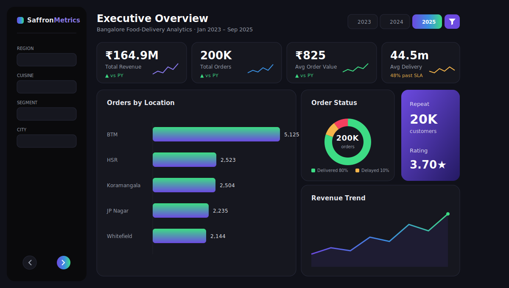
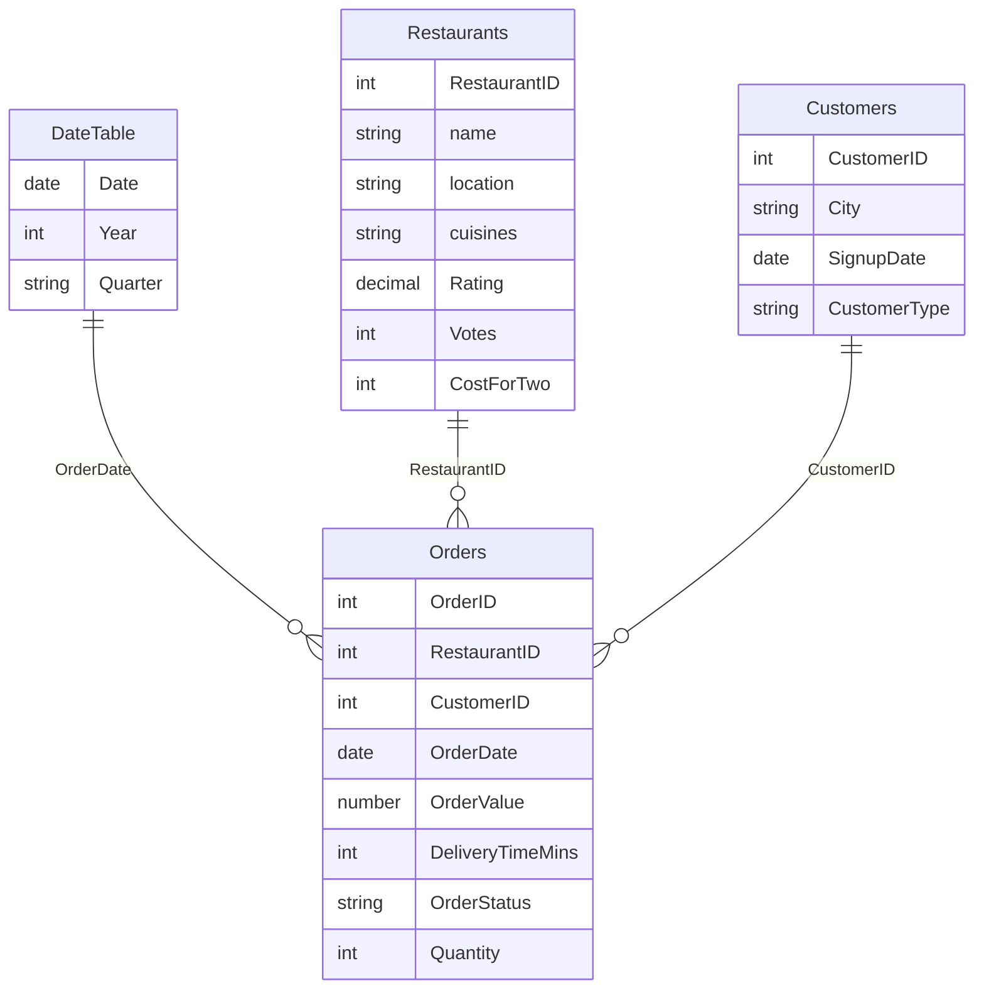

<!-- ============ HEADER ============ -->
<div align="center">


<a href="https://github.com/tarunmehrda/bangalore-food-delivery-analytics-powerbi">

</a>

<br/>


-3A8FE0?style=for-the-badge)


</div>

---

## 📑 Table of Contents
- [Overview](#-overview)
- [Business Problem & Objectives](#-business-problem--objectives)
- [Methodology](#-methodology)
- [Key Metrics](#-key-metrics-computed-from-the-real-dataset)
- [Key Insights](#-key-insights)
- [Dashboard Preview](#-dashboard-preview)
- [Data Model](#-data-model--star-schema)
- [Dataset & Data Dictionary](#-dataset--data-dictionary)
- [DAX Highlights](#-dax-highlights)
- [Challenges & Solutions](#-challenges--solutions)
- [Business Recommendations](#-business-recommendations)
- [Report Pages](#-report-pages)
- [Design System](#-design-system--indigo-noir)
- [Tech Stack](#-tech-stack--techniques)
- [Repository Structure](#-repository-structure)
- [How to Explore](#-how-to-explore)
- [What I Learned](#-what-i-learned)
- [Skills Demonstrated](#-skills-demonstrated)

---

## 🎯 Overview

**SaffronMetrics** is an end-to-end **Power BI** analytics product built on **200,000 food-delivery orders** across **56,000+ Bangalore restaurants**. It turns messy, real-world restaurant data into an interactive, executive-grade dashboard covering **revenue, delivery operations, customer behaviour, and restaurant performance**.

It demonstrates the **full BI lifecycle**: data cleaning in Power Query → a star-schema model → 50+ DAX measures → a custom-designed dark UI → deployment-ready documentation.

> 🍛 **Data:** enriched **Zomato Bangalore** restaurants + a synthetic 200K-row orders fact table spanning **Jan 2023 – Sep 2025**.

<div align="center">

### 🔗 &nbsp; [ Watch the Live Walkthrough ▶](#) &nbsp; • &nbsp; [ Open the Report 📊](report/Restaurant.pbix) &nbsp; • &nbsp; [ Full Docs 📚](docs/PROJECT_PLAN.md)

<sub>*(replace the walkthrough link with your Loom / YouTube video link)*</sub>

</div>

---

## 💼 Business Problem & Objectives

A food-delivery operator in Bangalore needs to understand **where revenue comes from, why orders are late or cancelled, and which customers and restaurants drive the business** — all in one place, refreshed and self-serve.

**Objectives:**
1. 📈 Track headline KPIs (revenue, orders, AOV, delivery time) with period-over-period trends.
2. 🚚 Diagnose **delivery performance** — how many orders miss the 45-minute SLA, and where.
3. 👥 Segment **customers** (new vs returning) and measure repeat behaviour.
4. 🍴 Rank **restaurants, cuisines, and locations** by revenue and rating.
5. 🧠 Surface **AI-driven drivers** of late delivery and cancellations.

---

## 🧭 Methodology

| Phase | What was done |
|---|---|
| **1. Extract** | Imported a 4-sheet Excel workbook (Orders, Restaurants, Customers, DateTable). |
| **2. Transform** | Power Query: typed columns, cleaned dirty `rate`, stripped cost separators, **deduplicated restaurants**. |
| **3. Model** | Built a **star schema** — single-direction relationships, marked date table, hidden keys. |
| **4. Measure** | Authored **50+ DAX** measures across KPIs, status, customers, restaurants, and time intelligence. |
| **5. Visualize** | Designed **6 report pages** with a custom "Indigo Noir" theme, drill-through, and AI visuals. |
| **6. Deliver** | Documented deployment, RLS, and governance for hand-off. |

---

## 📊 Key Metrics *(computed from the real dataset)*

<div align="center">

| 💰 Total Revenue | 📦 Total Orders | 🧾 Avg Order Value | ⏱️ Avg Delivery |
|:---:|:---:|:---:|:---:|
| **₹164.9M** *(≈ ₹16.5 Cr)* | **200,000** | **₹825** | **44.5 min** |

| ✅ Delivered | ⚠️ Delayed | ❌ Cancelled | 👥 Customers | 🍴 Restaurants |
|:---:|:---:|:---:|:---:|:---:|
| **80.1%** | **9.9%** | **10.0%** | **20,000** | **56,250** |

</div>

---

## 💡 Key Insights

- 🚨 **48% of orders breach the 45-minute delivery SLA** — the single biggest operational lever, surfaced on the *Delivery & Operations* page.
- 🍛 **North Indian (21K)** and **Chinese (15.5K)** dominate cuisine listings, followed by South Indian, Fast Food, and Biryani.
- 📍 **BTM, HSR, and Koramangala 5th Block** are the top delivery hotspots by order volume.
- 💳 Average basket sits at **₹825** across **~10 orders per customer**, with a **10% cancellation rate** dragging on revenue.
- ⭐ Average restaurant rating is **3.70 / 5** at an average cost of **₹555 for two** — a value-heavy, price-sensitive market.

---

## 📸 Dashboard Preview

<div align="center">



<sub>↑ Design preview in the Indigo Noir theme. Replace the grid below with your real page screenshots.</sub>

</div>

### 🖼️ Your dashboard pages
> 📌 Capture each page in Power BI Desktop (`Win + Shift + S`) and save into `assets/screenshots/` with the exact filenames below — they'll appear here automatically.

| Executive Overview | Restaurant Performance |
|:---:|:---:|
|  |  |
| **Delivery & Operations** | **Customer Analytics** |
|  |  |
| **Advanced Insights (AI)** | **Restaurant 360 (Drill-through)** |
|  |  |

---

## 🧱 Data Model — Star Schema

A clean **single-fact star schema**: one `Orders` fact surrounded by conformed dimensions, single-direction filters, and a marked date table.



---

## 🗃️ Dataset & Data Dictionary

| Table | Rows | Role |
|---|---:|---|
| **Orders** | 200,000 | Fact (grain = one order) |
| **Restaurants** | 56,250 | Dimension |
| **Customers** | 20,000 | Dimension |
| **DateTable** | 1,001 | Date dimension |

<details>
<summary><b>📖 Click to expand the full data dictionary</b></summary>

### Orders (fact)
| Column | Type | Description |
|---|---|---|
| OrderID | int | Unique order key |
| RestaurantID | int | FK → Restaurants |
| CustomerID | int | FK → Customers |
| OrderDate | date | Date the order was placed |
| OrderValue | number | Order amount (₹) |
| DeliveryTimeMins | int | Delivery duration in minutes |
| OrderStatus | text | Delivered / Delayed / Cancelled |
| Quantity | int | Items in the order |

### Restaurants (dimension)
| Column | Type | Description |
|---|---|---|
| RestaurantID | int | Unique restaurant key |
| name | text | Restaurant name |
| location | text | Area (e.g. BTM, HSR) |
| cuisines | text | Comma-separated cuisines |
| rate → **Rating** | decimal | Cleaned from `"4.1/5"` text |
| votes → **Votes** | int | Number of ratings |
| approx_cost(for two people) → **CostForTwo** | int | Cost for two (₹) |
| online_order / book_table | text | Yes / No flags |

### Customers (dimension)
| Column | Type | Description |
|---|---|---|
| CustomerID | int | Unique customer key |
| City | text | Customer area |
| SignupDate | date | Registration date |
| CustomerType | text | New / Returning |

</details>

---

## 🧮 DAX Highlights

A few of the 50+ measures — the full library is in [`docs/03_DAX_Library.md`](docs/03_DAX_Library.md) and [`docs/measures.dax`](docs/measures.dax).

```dax
-- Late-delivery rate (orders past the 45-min SLA)
Late Delivery % =
DIVIDE(
    CALCULATE( [Total Orders], Orders[Delivery Status] = "Late" ),
    [Total Orders]
)
```

```dax
-- Year-over-year revenue growth (time intelligence)
Revenue YoY % =
VAR PY = CALCULATE( [Total Revenue], SAMEPERIODLASTYEAR( DateTable[Date] ) )
RETURN DIVIDE( [Total Revenue] - PY, PY )
```

```dax
-- Repeat customer share (iterator over customers)
Repeat Customers =
COUNTROWS(
    FILTER(
        VALUES( Orders[CustomerID] ),
        CALCULATE( COUNT( Orders[OrderID] ) ) > 1
    )
)
```

---

## 🧩 Challenges & Solutions

| Challenge | Solution |
|---|---|
| `rate` stored as dirty text (`"4.1/5"`, `"NEW"`, `"-"`, nulls) | Split on `/`, coerce to decimal, route errors to `null` in Power Query |
| 56K rows with **duplicate restaurant listings** | Deduplicated to one row per `RestaurantID` for a clean dimension |
| `approx_cost` with thousands separators | Removed separators, cast to whole number → `CostForTwo` |
| 200K-row fact — performance | Star schema, integer keys, single-direction filters, disabled auto date/time |
| Local Excel can't auto-refresh in the cloud | Documented OneDrive/SharePoint + gateway options ([docs/05](docs/05_Deployment_and_Governance.md)) |

---

## ✅ Business Recommendations

1. **Fix the 45-minute SLA** — 48% of orders breach it; target dispatch and routing in high-volume areas (BTM/HSR) first.
2. **Cut the 10% cancellation rate** — investigate cancellation reasons by restaurant and time-of-day.
3. **Double down on winners** — North Indian, Chinese, and Biryani drive volume; prioritise onboarding and promos there.
4. **Lift low-rated restaurants** — restaurants rated < 3.0 drag the 3.70 average; coach or de-list persistent under-performers.

---

## 📑 Report Pages

| # | Page | What it answers |
|---|---|---|
| 1 | **Executive Overview** | Headline KPIs, revenue trend vs prior year, order-status mix |
| 2 | **Restaurant Performance** | Cuisine & location performance, rating-vs-cost, top restaurants |
| 3 | **Delivery & Operations** | Delivery-time trends, late-delivery SLA, cancellations |
| 4 | **Customer Analytics** | New vs returning, repeat behaviour, city distribution |
| 5 | **Advanced Insights** | AI visuals — Q&A, key drivers, decomposition |
| 6 | **Restaurant 360** | Drill-through detail for any single restaurant |

---

## 🎨 Design System — "Indigo Noir"

<div align="center">

| Canvas | Card | Accent | Positive | Negative | Text |
|:---:|:---:|:---:|:---:|:---:|:---:|
| `#101119` | `#16171F` | `#6C4AE0` | `#3DDC84` | `#F43F5E` | `#EAECF2` |
| ⬛ | ⬛ | 🟣 | 🟢 | 🔴 | ⬜ |

</div>

Dark canvas, floating rounded cards, indigo accent with purple→green gradient charts, sparkline KPIs, and a left navigation rail. Import via **View → Themes → Browse** → [`design/theme.json`](design/theme.json). Build guide: [`design/Design_Match_Guide.md`](design/Design_Match_Guide.md).

There's also a **3D animated web version** of this README in [`website/`](website/) — deployable free via GitHub Pages.

---

## 🛠️ Tech Stack & Techniques

<div align="center">

`Power BI Desktop` • `Power Query (M)` • `DAX` • `Star-Schema Modeling` • `Excel` • `Row-Level Security`

</div>

- **Power Query / M** — ETL, type-setting, dirty-data cleaning, deduplication, query folding
- **DAX** — KPIs, `CALCULATE` filter context, iterators (`RANKX`, `SUMX`, `FILTER`), time-intelligence (YTD, PY, YoY %, MoM), what-if & field parameters, a calculation group
- **Modeling** — star schema, single-direction relationships, marked date table, disabled auto date/time
- **Interactivity** — slicers, drill-through, bookmarks, custom tooltips, AI visuals (Key Influencers, Decomposition Tree, Q&A)
- **Design** — a hand-built "Indigo Noir" dark theme + a 3D animated landing page

---

## 🗂️ Repository Structure

```
bangalore-food-delivery-analytics-powerbi/
├── README.md
├── report/
│   └── Restaurant.pbix              # 📊 the Power BI report (open this)
├── data/
│   └── dataset.xlsx                 # source workbook (4 sheets)
├── design/
│   ├── theme.json                   # Indigo Noir dark theme
│   ├── theme-light.json             # light theme option
│   └── Design_Match_Guide.md        # step-by-step UI build guide
├── docs/
│   ├── PROJECT_PLAN.md              # master plan & index
│   ├── 01_PowerQuery_Transformations.md
│   ├── 02_DataModel.md
│   ├── 03_DAX_Library.md
│   ├── 04_Report_Design.md
│   ├── 05_Deployment_and_Governance.md
│   ├── 06_Milestones_and_Compliance.md
│   └── measures.dax                 # DAX library
├── website/                         # 🌐 3D animated web README (deploy free)
│   ├── index.html
│   ├── css/ · js/
│   └── README.md
└── assets/
    └── screenshots/                 # dashboard PNGs
```

---

## 🚀 How to Explore

1. **Download** [`report/Restaurant.pbix`](report/Restaurant.pbix)
2. Open it in **[Power BI Desktop](https://powerbi.microsoft.com/desktop/)** (free)
3. *(optional)* Apply the theme: **View → Themes → Browse** → `design/theme.json`
4. Read the story in [`docs/PROJECT_PLAN.md`](docs/PROJECT_PLAN.md)

---

## 🎓 What I Learned

- Designing a **star schema** that stays fast on a 200K-row fact table.
- Writing **time-intelligence DAX** (PY, YoY, MoM) on a properly marked date table.
- Turning **dirty, real-world data** into a trustworthy model with Power Query.
- Building a **cohesive design system** and reusable theme for a professional look.
- Planning **deployment, refresh, and RLS** — thinking beyond the report to hand-off.

---

## 📈 Skills Demonstrated

| Area | Evidence |
|---|---|
| Data modeling | Star schema, cardinality, marked date table → [`docs/02_DataModel.md`](docs/02_DataModel.md) |
| ETL / cleaning | Dirty-`rate` parsing, dedup → [`docs/01_PowerQuery_Transformations.md`](docs/01_PowerQuery_Transformations.md) |
| DAX | 50+ measures, time-intelligence, what-if → [`docs/03_DAX_Library.md`](docs/03_DAX_Library.md) |
| Visualization & UX | Custom theme, 6 designed pages → [`docs/04_Report_Design.md`](docs/04_Report_Design.md) |
| Deployment | Publishing, refresh, RLS → [`docs/05_Deployment_and_Governance.md`](docs/05_Deployment_and_Governance.md) |
| Business storytelling | Insights → recommendations across all pages |

---

<div align="center">

### 👤 Author

**Tarun** — Data Analyst
[](https://github.com/tarunmehrda)

<br/>

⭐ *If you found this project useful, consider giving it a star!*


</div>
